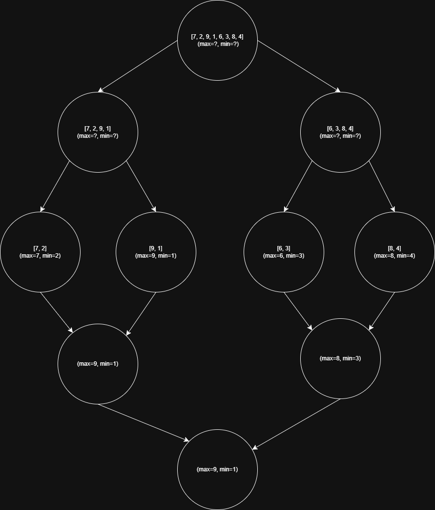

# Algoritmo MaxMin Select

Uma implementação em Python do algoritmo de divisão e conquista para encontrar o valor máximo e mínimo em um array.

## Algoritmo

### Funcionamento (Linha por Linha)

1. **max_min_select(arr, left, right)**

   ```python
   def max_min_select(arr, left, right):
       # Caso base: um elemento
       if left == right:
           return arr[left], arr[left]

       # Caso base: dois elementos
       if right - left == 1:
           if arr[left] > arr[right]:
               return arr[left], arr[right]
           return arr[right], arr[left]

       # Divisão
       mid = (left + right) // 2

       # Conquista: chamadas recursivas
       max1, min1 = max_min_select(arr, left, mid)
       max2, min2 = max_min_select(arr, mid + 1, right)

       # Combinação
       return max(max1, max2), min(min1, min2)
   ```

   - Divide o array em duas metades
   - Recursivamente encontra máximo e mínimo em cada metade
   - Combina os resultados usando max() e min()

## Executando o Projeto

1. Clone o repositório
   ```bash
   git clone https://github.com/AnaCarolinaMello/fpaa-trabalho-2
   ```
2. Certifique-se de que o Python 3.x está instalado
3. Execute o programa:
   ```bash
   python main.py
   ```
   ou
   ```bash
   python3 main.py
   ```
   ou
   ```bash
   py main.py
   ```
4. Digite um número ou r para ver o resultado

## Relatório Técnico

### Análise de Complexidade por Contagem de Operações

O algoritmo realiza comparações nas seguintes etapas:

1. **Casos Base**

   - Para 1 elemento: 0 comparações
   - Para 2 elementos: 1 comparação (arr[left] > arr[right])

2. **Divisão e Conquista**
   Para n elementos, o processo é:

   - Array é dividido em duas metades de n / 2 elementos
   - Cada metade é processada recursivamente
   - Na combinação: 2 comparações (uma para max, uma para min)

3. **Contagem Total de Comparações**
   Seja C(n) o número de comparações para n elementos:

   - C(1) = 0
   - C(2) = 1
   - C(n) = C(n/2) + C(n/2) + 2

   Desenvolvendo a recorrência:

   - C(n) = 2C(n/2) + 2
   - C(n/2) = 2C(n/4) + 2
   - C(n/4) = 2C(n/8) + 2</br>
     ...até chegar aos casos base

   Para n = 2^k, após k substituições:</br>
   C(n) = 2(2C(n/4) + 2) + 2</br>
   = 4C(n/4) + 6</br>
   = 8C(n/8) + 14</br>
   = 16C(n/16) + 30</br>
   ...</br>
   = 2^k _ C(1) + 2(2^(k-1) - 1)</br>
   = n _ 0 + 2(n/2 - 1)</br>
   = n - 2</br>

Portanto, o número total de comparações é n - 2, resultando em complexidade temporal O(n).

### Análise pelo Teorema Mestre

Para a recorrência T(n) = 2T(n/2) + O(1):

1. **Parâmetros**

   - a = 2 (número de subproblemas)
   - b = 2 (fator de divisão)
   - f(n) = O(1) (custo da combinação)

2. **Cálculo de logₐb**

   - log₂2 = 1

3. **Aplicação do Teorema Mestre**
   - f(n) = O(1)
   - n^(log₂2) = n
   - Como 1 = O(n^0), estamos no caso 2
   - Portanto, T(n) = O(n)

### Complexidade Final

- **Espaço**: O(log n) devido à pilha de recursão

### Diagrama Visual do Algoritmo



Comparações por nível: </br>
Nível 0 (raiz): 2 comparações (max e min finais) </br>
Nível 1 (meio): 4 comparações (2 por metade) </br>
Nível 2 (folhas): 4 comparações (1 por par) </br>
Total: 10 comparações </br>

### Vantagens

1. Eficiente para grandes conjuntos de dados
2. Número ótimo de comparações
3. Facilmente paralelizável
